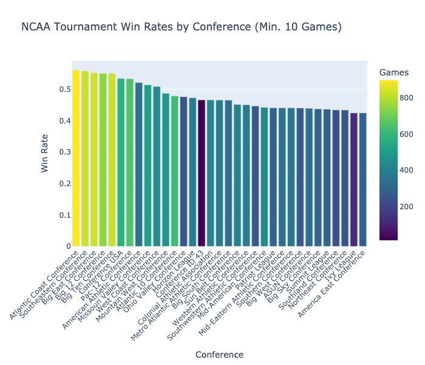
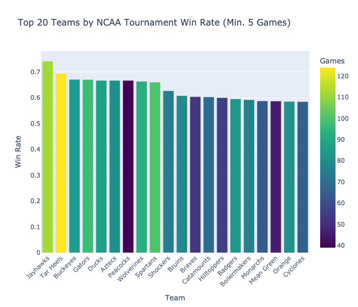
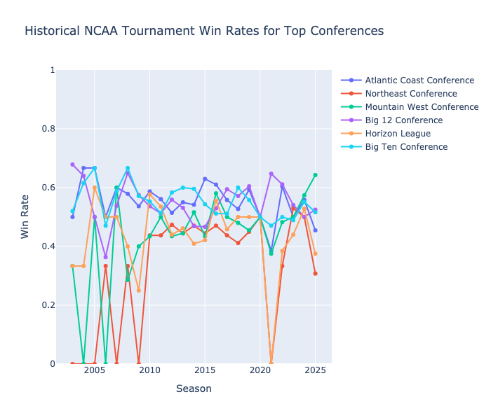
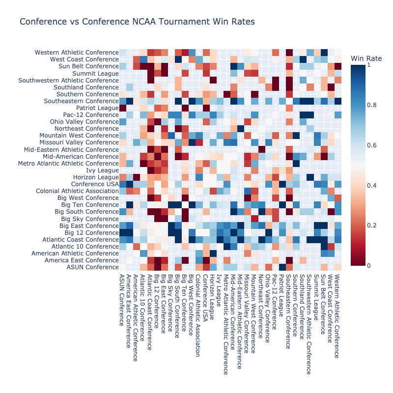

# NCAA Tournament Performance Analysis by Conference and Team

*Analysis Date: 2025-03-04*

## Executive Summary

This analysis examines historical NCAA tournament performance patterns across conferences and teams. It identifies winning trends, consistent performers, and notable matchups in tournament play.

## Key Findings

### Conference Performance

Top performing conferences by win rate (minimum 10 tournament games):

| Conference | Win Rate | Games Played | Avg Point Differential |
|------------|----------|-------------|----------------------|
| Atlantic Coast Conference | 0.561 | 896 | 1.9 |
| Southeastern Conference | 0.559 | 825 | 2.0 |
| Big East Conference | 0.553 | 834 | 2.1 |
| Big 12 Conference | 0.551 | 744 | 2.2 |
| Big Ten Conference | 0.551 | 828 | 1.4 |

### Team Performance

Top performing teams by win rate (minimum 5 tournament games):

| Team | Win Rate | Games Played | Avg Point Differential |
|------|----------|-------------|----------------------|
| Lions | 0.857 | 7 | 9.6 |
| Warriors | 0.833 | 6 | 6.0 |
| Jayhawks | 0.741 | 112 | 7.9 |
| Blue Devils | 0.735 | 102 | 7.0 |
| Tar Heels | 0.694 | 124 | 6.9 |
| Buckeyes | 0.671 | 85 | 4.6 |
| Gators | 0.670 | 97 | 6.5 |
| Aztecs | 0.667 | 81 | 3.8 |
| Ducks | 0.667 | 87 | 4.1 |
| Peacocks | 0.667 | 39 | 1.2 |

### Historical Conference Performance

The following visualization shows tournament win rates over time for top conferences:

### Conference Matchup Analysis

This heatmap shows head-to-head win rates between conferences in tournament play:

#### Notable Conference Matchups

Matchups with significant performance differences (minimum 3 games):

| Conference 1 | Conference 2 | Games | Conf 1 Win Rate |
|--------------|--------------|-------|----------------|
| Big Ten Conference | America East Conference | 4 | 1.000 |
| Big Ten Conference | Patriot League | 6 | 1.000 |
| Big Ten Conference | Big Sky Conference | 4 | 1.000 |
| Big Ten Conference | Big South Conference | 3 | 1.000 |
| Big Ten Conference | Big West Conference | 5 | 1.000 |
| Southeastern Conference | America East Conference | 4 | 1.000 |
| Southeastern Conference | Southwestern Athletic Conference | 4 | 1.000 |
| Southeastern Conference | Southland Conference | 3 | 1.000 |
| Southeastern Conference | Western Athletic Conference | 6 | 1.000 |
| Southeastern Conference | Big South Conference | 3 | 1.000 |

## Methodology

This analysis uses historical NCAA tournament game data to calculate win rates and performance metrics for conferences and teams. It considers all available tournament games in the dataset and includes:

- Win rates for conferences and teams
- Point differentials to assess dominance
- Historical performance trends

### Limitations

- The analysis is based on available data and may not include all historical tournaments
- Conference realignment over time can affect historical trend analysis
- Sample sizes vary by conference and team, affecting statistical significance
