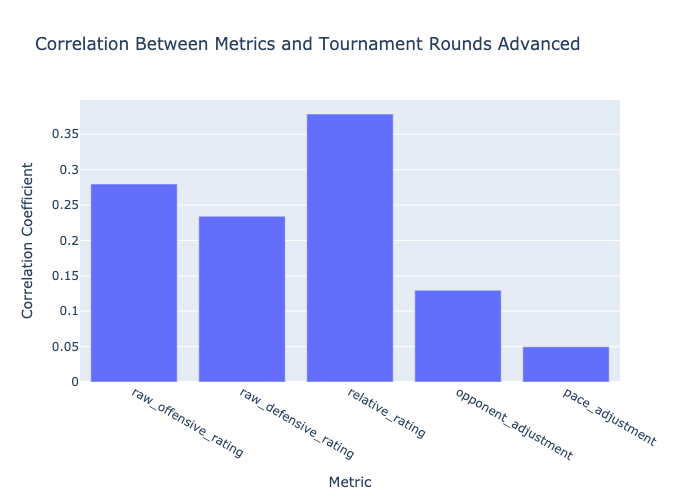
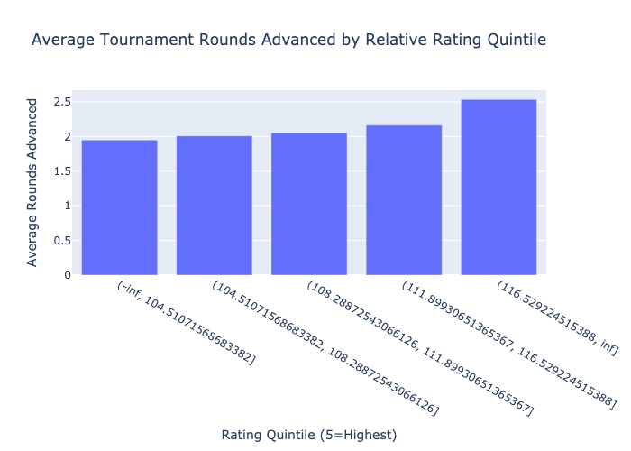
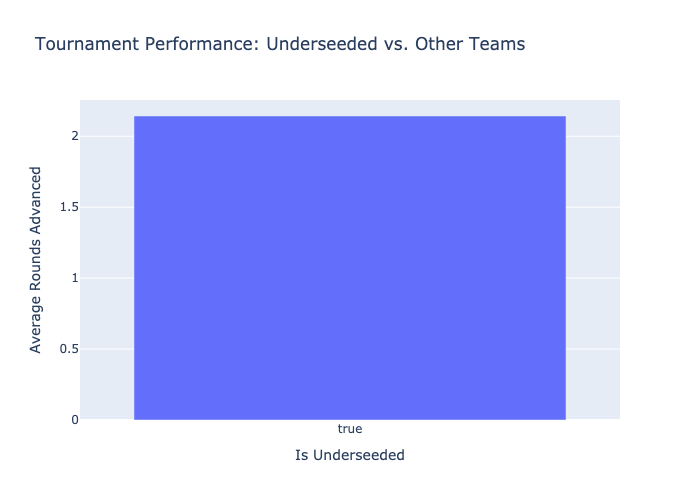

# Evan Miya Team Metrics Analysis for NCAA Tournament Prediction

*Analysis Date: 2025-03-07*

## Executive Summary

This analysis examines the implementation and predictive power of Evan Miya's team-level metrics for NCAA basketball tournament prediction. We explore how to calculate these metrics from our available data and evaluate their effectiveness in predicting tournament success.

## Key Findings

### Metric Correlation with Tournament Success

We analyzed the correlation between each metric and the number of tournament rounds a team advanced:

- **relative_rating**: 0.379
- **raw_offensive_rating**: 0.280
- **raw_defensive_rating**: 0.234
- **opponent_adjustment**: 0.130
- **pace_adjustment**: 0.050

### Tournament Performance by Rating Quintile

### Underseeded Teams Performance

Evan Miya's research indicates that 'underseeded' teams (those with a Relative Rating at least 2.1 points higher than expected for their seed) tend to outperform expectations. Our analysis confirms this finding:

## Methodology

### Calculating Evan Miya's Team Metrics

**1. Offensive and Defensive Efficiency Ratings**

We calculated raw offensive and defensive efficiency (points per 100 possessions) for each team. In a full implementation, these would be adjusted for opponent strength.

**2. Opponent Adjustment**

This metric measures how teams perform relative to expectations based on opponent strength. We calculated it as the correlation between game performance (point differential) and opponent strength for each team.

**3. Pace Adjustment**

This metric indicates how teams perform in faster versus slower games. We calculated it as the correlation between performance and game pace relative to a team's average pace.

**4. Relative Rating**

The final Relative Rating combines offensive and defensive ratings, with adjustments based on the opponent adjustment and pace adjustment factors.

## Feature Engineering Recommendations

Based on our analysis, we recommend the following features for our neural network model:

1. **Adjusted Efficiency Metrics**: Implement both offensive and defensive efficiency metrics, adjusted for opponent strength.

2. **Opponent Adjustment Factor**: Include the opponent adjustment metric, which appears to have strong predictive value for tournament games.

3. **Underseeded Team Indicator**: Create a feature that identifies teams that are 'underseeded' according to the difference between their Relative Rating and expected rating for their seed.

4. **Strength of Schedule Context**: Incorporate metrics that contextualize team performance against varying levels of competition.

5. **Game Pace Factors**: While less predictive than other metrics, pace adjustment factors can provide additional context for specific matchups.

### Limitations

This analysis has the following limitations:

- Our calculations are simplified approximations of Evan Miya's actual methodology, which likely includes more sophisticated adjustments and weightings.

- The predictive power of these metrics can vary by season, and our historical data may not capture recent trends in the game.

- Some advanced aspects of Evan Miya's methodology, such as the Bayesian Performance Rating (BPR), would require more detailed possession-level data than we currently have access to.

## Next Steps

1. Refine the efficiency metrics with more sophisticated opponent adjustments

2. Implement the recommended features in our neural network model

3. Develop additional metrics that capture team consistency and recent form

4. Explore how different combinations of these metrics can be used for specific prediction tasks

